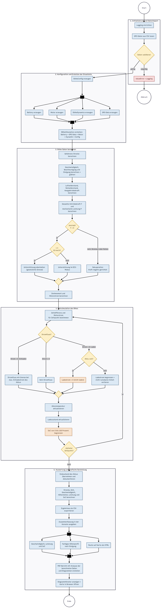
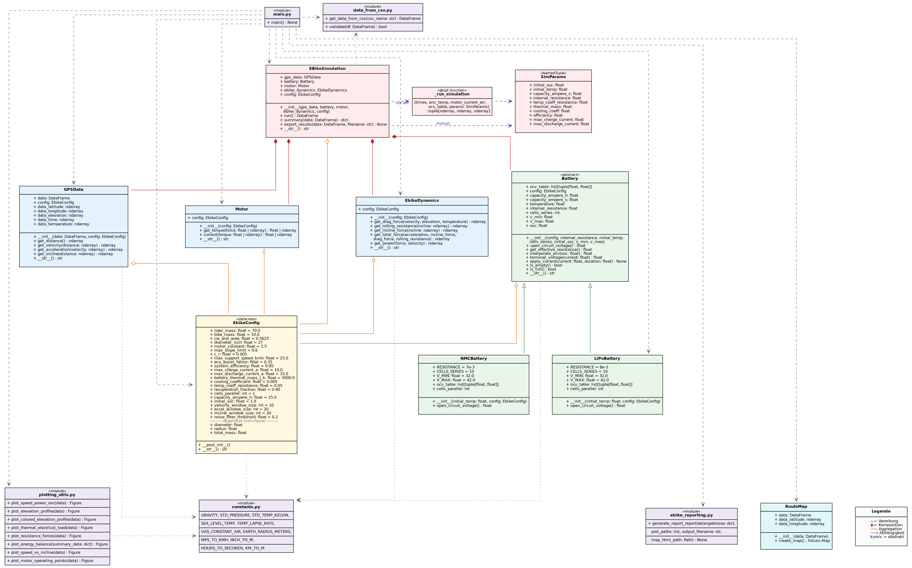

# E-Bike Simulation

Abschlussprojekt **Programmieren 1** (MCI BA-MECH, SS 2026) — Šotek \& Thaler

Python-Anwendung zur Auslegung eines E-Bikes anhand realer GPS-Daten.
Anhand von zeitabhängigen Koordinaten und Höhenangaben werden Geschwindigkeit, Beschleunigung,
Steigung, Fahrwiderstände, Leistung, Drehmoment und Motorstrom berechnet. Daraus werden

der Ladestand (SoC) und die Temperatur des Akkus über die gesamte Fahrt simuliert

und Diagramme, eine Routen-Karte sowie ein PDF-Bericht erstellt.


## Projektstruktur

```

Abschlussprojekt_Programmieren_Sotek_Thaler/
├── src/                                    #Codeverzeichnis
│   ├── main.py                             #Hauptprogramm (Startpunkt)
│   ├── data_from_csv.py                    #CSV lesen und validieren
│   ├── gps_data.py                         #Strecke, Geschwindigkeit, Beschleunigung, Steigung
│   ├── ebike_config.py                     #Bike-Parameter
│   ├── ebike_dynamics.py                   #Fahrwiderstände und Leistung
│   ├── motor.py                            #Drehmoment und Motorstrom
│   ├── battery.py                          #Akku-Modell (LiPo und NMC)
│   ├── ebike_simulation.py                 #Zusammenführung der Simulation
│   ├── plotting_utils.py                   #Diagramme
│   ├── route_map.py                        #Route auf Landkarte (folium)
│   ├── ebike_reporting.py                  #PDF-Bericht (reportlab)
│   └── constants.py                        #Physikalische Konstanten und Umrechnungsfaktoren
├── data/
│   ├── raw/
        └── final_project_input_data.csv    #Eingabedaten
│   └── processed/                          #Ausgabe der CSV des Simulations-Ergebnisses
├── results/                                #Diagramme, Routenkarte, PDF-Bericht
├── docs/                                   #Aktivitätsdiagramm + UML-Diagramm
├── requirements.txt
├── README.md
└── LICENSE

```


## Installationen

Python **3.10** oder neuer


**1. Repository klonen und in das Verzeichnis gehen**

```bash
git clone https://github.com/tm3930/Abschlussprojekt_Programmieren_Sotek_Thaler.git
```
```bash
cd Abschlussprojekt_Programmieren_Sotek_Thaler
```

**2. Virtuelle Umgebung anlegen und aktivieren** (optional, empfehlenswert)

```bash
python -m venv .venv
```

Windows:
```bash
.venv\Scripts\activate

```

macOS / Linux:
```bash
source .venv/bin/activate
```

**3. Benötigte Pakete installieren**

```bash
pip install -r requirements.txt
```

Installiert werden: `numpy`, `pandas`, `matplotlib`, `numba`, `folium` und `reportlab`.


**4. Eingabedaten bereitstellen**

Die Datei `final_project_input_data.csv` muss unter `data/raw/` liegen.
Erwartetes Format: Semikolon als Trennzeichen, Spalten `lat`, `lon`, `ele`, `time`,
`temperature`.


## Ausführung

Aus dem Projekt-Stammverzeichnis:

```bash
python src/main.py
```

Das Programm läuft vollständig automatisch durch und erzeugt:

|**Ausgabe**|**Ort**|
|-|-|
|Zusammenfassung der Fahrt|Konsole|
|Diagramme (8 PNG-Dateien)|results/|
|Interaktive Routenansicht auf Landkarte|results/route_map.html|
|PDF-Bericht|results/ebike\_simulation_analyse.pdf|
|Ergebnisdaten|data/processed/simulation_results.csv|
|Protokoll/Log|app.log|


Nach Ausführung öffnet sich ein interaktives Diagrammfenster (matplotlib) und die Routenansicht als HTML im Browser.

Um das Programm zu beenden, müssen die Diagrammfenster geschlossen werden.


Jedes Modul lässt sich nach Bedarf einzeln testen. Beispiel:

```bash
python src/motor.py
```


## Softwarestruktur

Der gesamte Ablauf der Simulation ist in einem Aktivitätsdiagramm im Ordner `docs/` dargestellt:

[](docs/aktivitaetsdiagramm.pdf)

Außerdem ist in einem UML-Diagramm im Ordner `docs/` die Klassentruktur dargestellt:

[](docs/uml_diagramm.pdf)


## Physikalische Formeln

|**Größe**|**Formel**|
|-|-|
|Strecke|Haversine-Formel aus Breiten- und Längengrad|
|Geschwindigkeit|v = Δs / Δt|
|Beschleunigung|a = Δv / Δt|
|Steigung|α = arcsin(Δh / Δs)|
|Luftwiderstand|F\_D = 0.5 \* ρ \* cw·A \* v² (ρ aus Höhe und Temperatur)|
|Rollwiderstand|F\_R = m \* g \* cos(α) \* c\_r|
|Hangabtrieb|F\_H = m \* g \* sin(α)|
|Gesamtkraft|F = m \* a + F\_H + F\_D + F\_R|
|Leistung|P = F \* v|
|Drehmoment|T = F \* r|
|Motorstrom|I = T / Km|
|Klemmenspannung|U = U\_OCV(SoC) − R\_i \* I|
|Ladezustand|SoC = SoC − (I \* Δt) / C|


## Konfiguration

Alle Parameter sind zentral in `src/ebike_config.py` ('EbikeConfig') hinterlegt und
können dort für eigene Untersuchungen geändert werden:

|**Parameter**|**Standard**|**Bedeutung**|
|-|-|-|
|rider\_mass / bike\_mass|70 / 10 kg|Masse Fahrer + Fahrrad|
|cw\_and\_area|0.5625 m²|cw-Wert × Stirnfläche|
|diameter\_inch|27|Raddurchmesser in Zoll|
|motor\_constant|1.5 Nm/A|Motorkonstante Km|
|c\_r|0.005|Rollwiderstandswert|
|capacity\_ampere\_h|15 Ah|Akkukapazität|
|cells\_parallel|1|parallel geschaltete Zellen|
|max\_support\_speed\_kmh|25 km/h|gesetzliche Abregelgrenze|
|eco\_assist\_factor|0.35|Unterstützungsgrad im ECO-Modus|
|system\_efficiency|0.85|Wirkungsgrad des Antriebs|
|recuperation\_fraction|0.40|Anteil der Bremskraft für Rekuperation|
|max\_charge\_current\_a|10 A|maximaler Ladestrom|
|max\_discharge\_current\_a|15 A|maximaler Entladestrom|
|velocity\_window\_size u. a.|10 / 20|Fenstergrößen der Glättung|


**Akkutyp wechseln:** Standardmäßig wird ein LiPo-Akku verwendet. Für den NMC-Akku in
`src/main.py` den Import und die Erzeugung ändern:

```python
from battery import NMCBattery
battery = NMCBattery(config=config, initial_temp=start_temp)
```


## Erweiterungen

Über die Minimalanforderungen hinaus wurden folgende Erweiterungen integriert:

* **Luftdichte aus Temperatur und Höhe** — barometrische Höhenformel und ideale
Gasgleichung statt eines konstanten Werts zur Berechnung des Luftwiderstands
* **Rollwiderstand** — zusätzlich zu Luftwiderstand und Hangabtriebskraft
* **Akkutemperatur** — Erwärmung durch Verlustleistung und Kühlung an die
Umgebung; Innenwiderstand steigt bei Kälte an
* **Bremswiderstand / Verlustenergie** — Rekuperationsenergie, die wegen vollem Akku
oder überschrittenem Ladestrom nicht gespeichert werden kann, wird als
Verlustleistung erfasst und ausgewiesen
* **Routenkarte** — interaktive OpenStreetMap-Karte der Route mit `folium`
* **PDF-Bericht** — automatisch erzeugter Bericht mit Kennzahlen und Diagrammen
zur übersichtlichen Einsicht (`reportlab`)
* **Umfangreiche Diagramme** — acht Darstellungen, u. a. farbiges Höhenprofil
(Einfärbung nach Steigung), Aufschlüsselung der Fahrwiderstände, Energiebilanz,
thermische und elektrische Akkubelastung sowie Motor-Arbeitspunkte
* **Realistisches Antriebsverhalten** — Unterstützung im ECO-Modus und gesetzliche
Abregelung ab 25 km/h
* **Datenvalidierung** — Prüfung auf fehlende Werte, unplausible Koordinaten, Höhen,
Temperaturen und nicht aufsteigende Zeitstempel
* **Glättung der GPS-Daten** — gleitender Mittelwert gegen Messrauschen
* **Rechenbeschleunigung** — die Zeitschritt-Simulation ist mit `numba` (JIT)
kompiliert, um die Rechenzeit zu reduzieren
* **Ergebnis-Export** — alle berechneten Größen als CSV in `data/processed/`


## Autoren

Šimon Šotek \& Markus Thaler — MCI, BA-MECH25


## Lizenz

Siehe `LICENSE`.

